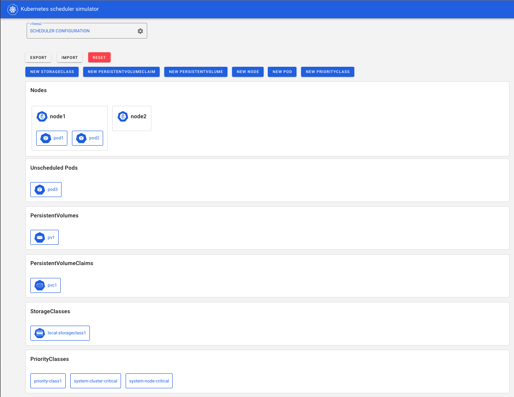
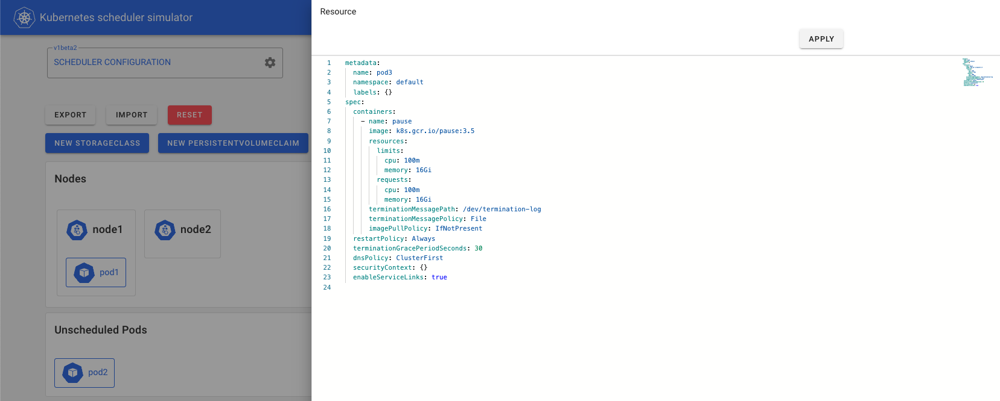
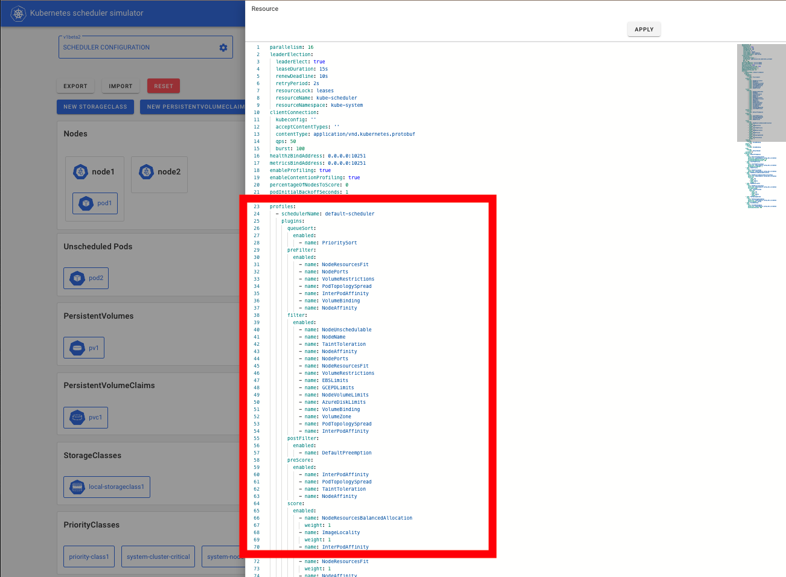

# Web-based Kubernetes scheduler simulator

Hello world. Here is web-based Kubernetes scheduler simulator.

On the simulator, you can create/edit/delete these resources to simulate a cluster.

- Nodes
- Pods
- Persistent Volumes
- Persistent Volume Claims
- Storage Classes
- Priority Classes



You can create resources with yaml file as usual.



And, after pods are scheduled, you can see the results of

- Each Filter plugins
- Each Score plugins
- Final score (normalized and applied Plugin Weight)


You can configure the scheduler on the simulator through KubeSchedulerConfiguration.

[Scheduler Configuration | Kubernetes](https://kubernetes.io/docs/reference/scheduling/config/)

You can pass a KubeSchedulerConfiguration file via the environment variable `KUBE_SCHEDULER_CONFIG_PATH` and the simulator will start kube-scheduler with that configuration.

Note: changes to any fields other than `.profiles` are disabled on simulator, since they do not affect the results of the scheduling.



## Background

In real Kubernetes, we cannot know the results of scheduling in detail without reading the logs, which usually requires privileged access to the control plane.
Therefore, we have developed a simulator for kube-scheduler -- you can try out the behavior of the scheduler with web UI while checking which plugin made what decision for which Node.

It can be used to learn about the Kubernetes scheduler or to examine the detailed behavior of plugins, etc.

## Getting started

### Run with Docker

We have [docker-compose.yml](./docker-compose.yml) to use the simulator easily.

You can use it with the below command.

```bash
make docker_build_and_up
```

Then, you can access the simulator with http://localhost:3000

Note: Insufficient memory allocation sometimes causes problems in building the image.
Please allocate enough memory in that case.

### Run Locally

You have to run frontend, server and etcd.

#### Run simulator server and etcd

To run this simulator's server, you have to install Go and etcd.

You can install etcd with [kubernetes/kubernetes/hack/install-etcd.sh](https://github.com/kubernetes/kubernetes/blob/master/hack/install-etcd.sh).

```bash
make start
```

It starts etcd and simulator-server locally.

#### Run simulator frontend

To run the frontend, please see [README.md](./web/README.md) on ./web dir.

## Contributing

see [CONTRIBUTING.md](./CONTRIBUTING.md)

### other docs

- [how the simulator works](./docs/how-it-works.md)
- [API Reference](./docs/api.md)

## Community, discussion, contribution, and support

Learn how to engage with the Kubernetes community on the [community page](http://kubernetes.io/community/).

You can reach the maintainers of this project at:

- [Slack](http://slack.k8s.io/)
- [Mailing List](https://groups.google.com/forum/#!forum/kubernetes-dev)

### Code of conduct

Participation in the Kubernetes community is governed by the [Kubernetes Code of Conduct](code-of-conduct.md).

[owners]: https://git.k8s.io/community/contributors/guide/owners.md
[creative commons 4.0]: https://git.k8s.io/website/LICENSE
