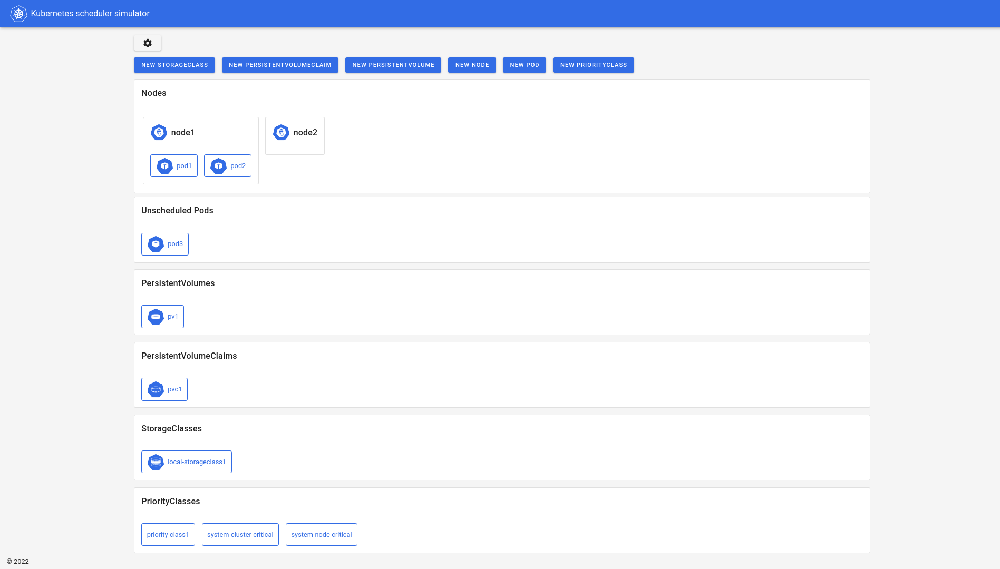
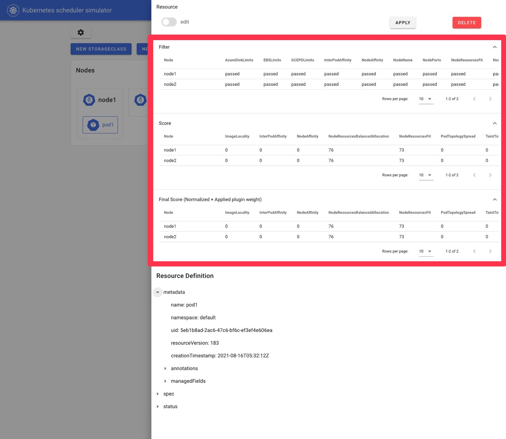
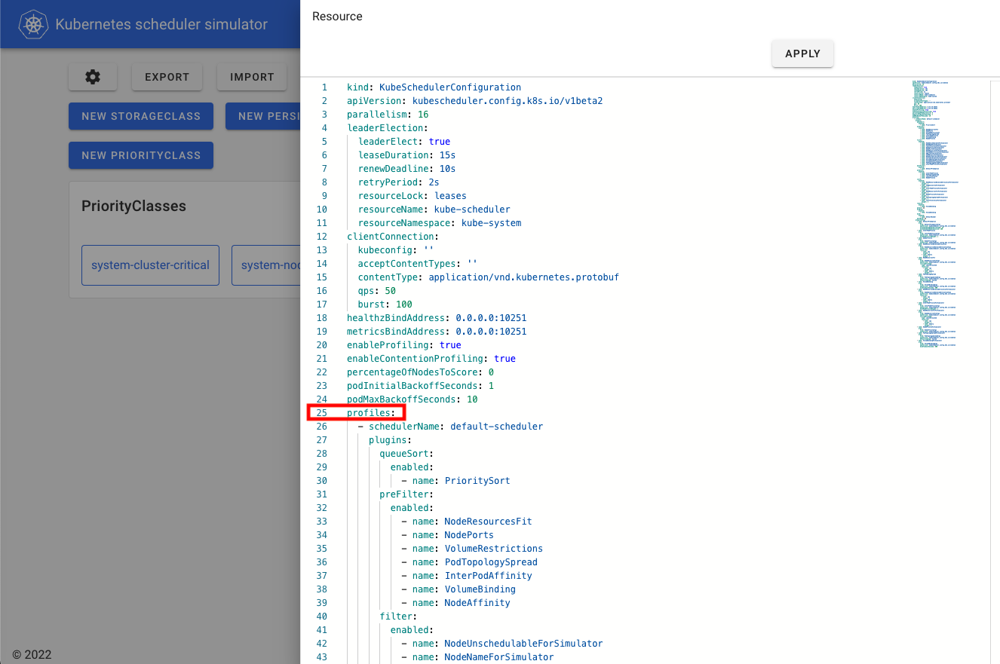
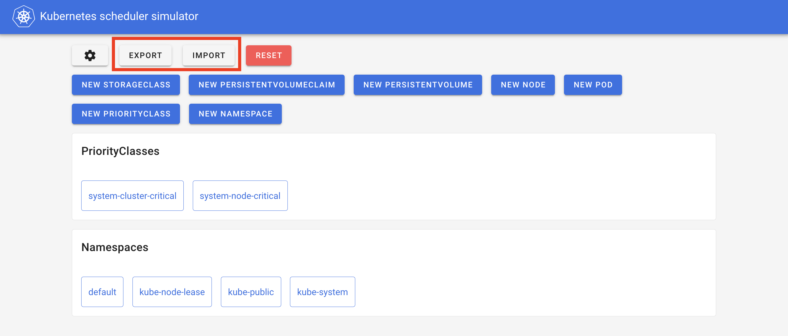

# Kubernetes scheduler simulator

Hello world. Here is Kubernetes scheduler simulator.

Nowadays, the scheduler is configurable/extendable in the multiple ways:
- configure with [KubeSchedulerConfiguration](https://kubernetes.io/docs/reference/scheduling/config/)
- add Plugins of [Scheduling Framework](https://kubernetes.io/docs/concepts/scheduling-eviction/scheduling-framework/)
- add [Extenders](https://github.com/kubernetes/enhancements/tree/5320deb4834c05ad9fb491dcd361f952727ece3e/keps/sig-scheduling/1819-scheduler-extender)
- etc...

But, unfortunately, not all configurations/expansions yield good results.
Those who customize the scheduler need to make sure their scheduler is working as expected,
and doesn't have an unacceptably negative impact on the scheduling.

In real Kubernetes, we cannot know the results of scheduling in detail without reading the logs,
which usually requires privileged access to the control plane.

That's why we are developing a simulator for kube-scheduler
-- you can try out the behavior of the scheduler while checking which plugin made what decision for which Node.

## Getting started 

```shell
git clone git@github.com:kubernetes-sigs/kube-scheduler-simulator.git
cd kube-scheduler-simulator
# Pull the latest stable images for simulator from the registry, 
# and run up all components.
make docker_up 
# All things up! 
```

You can access the simulator in http://localhost:3000.

Please see [this doc](./simulator/docs/running-simulator.md) to know other ways to run up the simulator.

## Simulator's architecture

We have several components:
- Simulator (in `/simulator`): the core implementation of the simulator
- Web UI (in `/web`): the Web client of the simulator
- Coming soon... :)  (see [./keps](./keps) to see some nice ideas we're working on)

### Simulator

Simulator is composed of debuggable scheduler + the HTTP server which mainly for the web UI.

There are several ways to integrate your scheduler into the simulator.
See [integrate-your-scheduler.md](simulator/docs/integrate-your-scheduler.md).

Simulator runs with a fake cluster powered by [KWOK](https://github.com/kubernetes-sigs/kwok)
You can create any resources in KWOK cluster via any clients (e.g. kubectl, k8s client library, or web UI described next).
And when you create Pods, 
Pods will be scheduled by the [debuggable scheduler](./simulator/docs/debuggable-scheduler.md),
and they'll get the annotations that explain how each Pod was evaluated by each scheduler plugin.

```yaml
kind: Pod
apiVersion: v1
metadata:
  name: hoge-pod
  annotations:
    kube-scheduler-simulator.sigs.k8s.io/bind-result: '{"DefaultBinder":"success"}'
    kube-scheduler-simulator.sigs.k8s.io/filter-result: >-
      {"node-282x7":{"AzureDiskLimits":"passed","EBSLimits":"passed","GCEPDLimits":"passed","InterPodAffinity":"passed","NodeAffinity":"passed","NodeName":"passed","NodePorts":"passed","NodeResourcesFit":"passed","NodeUnschedulable":"passed","NodeVolumeLimits":"passed","PodTopologySpread":"passed","TaintToleration":"passed","VolumeBinding":"passed","VolumeRestrictions":"passed","VolumeZone":"passed"},"node-gp9t4":{"AzureDiskLimits":"passed","EBSLimits":"passed","GCEPDLimits":"passed","InterPodAffinity":"passed","NodeAffinity":"passed","NodeName":"passed","NodePorts":"passed","NodeResourcesFit":"passed","NodeUnschedulable":"passed","NodeVolumeLimits":"passed","PodTopologySpread":"passed","TaintToleration":"passed","VolumeBinding":"passed","VolumeRestrictions":"passed","VolumeZone":"passed"}}
    kube-scheduler-simulator.sigs.k8s.io/finalscore-result: >-
      {"node-282x7":{"ImageLocality":"0","InterPodAffinity":"0","NodeAffinity":"0","NodeNumber":"0","NodeResourcesBalancedAllocation":"76","NodeResourcesFit":"73","PodTopologySpread":"200","TaintToleration":"300","VolumeBinding":"0"},"node-gp9t4":{"ImageLocality":"0","InterPodAffinity":"0","NodeAffinity":"0","NodeNumber":"0","NodeResourcesBalancedAllocation":"76","NodeResourcesFit":"73","PodTopologySpread":"200","TaintToleration":"300","VolumeBinding":"0"}}
    kube-scheduler-simulator.sigs.k8s.io/permit-result: '{}'
    kube-scheduler-simulator.sigs.k8s.io/permit-result-timeout: '{}'
    kube-scheduler-simulator.sigs.k8s.io/postfilter-result: '{}'
    kube-scheduler-simulator.sigs.k8s.io/prebind-result: '{"VolumeBinding":"success"}'
    kube-scheduler-simulator.sigs.k8s.io/prefilter-result: '{}'
    kube-scheduler-simulator.sigs.k8s.io/prefilter-result-status: >-
      {"InterPodAffinity":"success","NodeAffinity":"success","NodePorts":"success","NodeResourcesFit":"success","PodTopologySpread":"success","VolumeBinding":"success","VolumeRestrictions":"success"}
    kube-scheduler-simulator.sigs.k8s.io/prescore-result: >-
      {"InterPodAffinity":"success","NodeAffinity":"success","NodeNumber":"success","PodTopologySpread":"success","TaintToleration":"success"}
    kube-scheduler-simulator.sigs.k8s.io/reserve-result: '{"VolumeBinding":"success"}'
    kube-scheduler-simulator.sigs.k8s.io/result-history: >-
      [{"noderesourcefit-prefilter-data":"{\"MilliCPU\":100,\"Memory\":17179869184,\"EphemeralStorage\":0,\"AllowedPodNumber\":0,\"ScalarResources\":null}","kube-scheduler-simulator.sigs.k8s.io/bind-result":"{\"DefaultBinder\":\"success\"}","kube-scheduler-simulator.sigs.k8s.io/filter-result":"{\"node-282x7\":{\"AzureDiskLimits\":\"passed\",\"EBSLimits\":\"passed\",\"GCEPDLimits\":\"passed\",\"InterPodAffinity\":\"passed\",\"NodeAffinity\":\"passed\",\"NodeName\":\"passed\",\"NodePorts\":\"passed\",\"NodeResourcesFit\":\"passed\",\"NodeUnschedulable\":\"passed\",\"NodeVolumeLimits\":\"passed\",\"PodTopologySpread\":\"passed\",\"TaintToleration\":\"passed\",\"VolumeBinding\":\"passed\",\"VolumeRestrictions\":\"passed\",\"VolumeZone\":\"passed\"},\"node-gp9t4\":{\"AzureDiskLimits\":\"passed\",\"EBSLimits\":\"passed\",\"GCEPDLimits\":\"passed\",\"InterPodAffinity\":\"passed\",\"NodeAffinity\":\"passed\",\"NodeName\":\"passed\",\"NodePorts\":\"passed\",\"NodeResourcesFit\":\"passed\",\"NodeUnschedulable\":\"passed\",\"NodeVolumeLimits\":\"passed\",\"PodTopologySpread\":\"passed\",\"TaintToleration\":\"passed\",\"VolumeBinding\":\"passed\",\"VolumeRestrictions\":\"passed\",\"VolumeZone\":\"passed\"}}","kube-scheduler-simulator.sigs.k8s.io/finalscore-result":"{\"node-282x7\":{\"ImageLocality\":\"0\",\"InterPodAffinity\":\"0\",\"NodeAffinity\":\"0\",\"NodeNumber\":\"0\",\"NodeResourcesBalancedAllocation\":\"76\",\"NodeResourcesFit\":\"73\",\"PodTopologySpread\":\"200\",\"TaintToleration\":\"300\",\"VolumeBinding\":\"0\"},\"node-gp9t4\":{\"ImageLocality\":\"0\",\"InterPodAffinity\":\"0\",\"NodeAffinity\":\"0\",\"NodeNumber\":\"0\",\"NodeResourcesBalancedAllocation\":\"76\",\"NodeResourcesFit\":\"73\",\"PodTopologySpread\":\"200\",\"TaintToleration\":\"300\",\"VolumeBinding\":\"0\"}}","kube-scheduler-simulator.sigs.k8s.io/permit-result":"{}","kube-scheduler-simulator.sigs.k8s.io/permit-result-timeout":"{}","kube-scheduler-simulator.sigs.k8s.io/postfilter-result":"{}","kube-scheduler-simulator.sigs.k8s.io/prebind-result":"{\"VolumeBinding\":\"success\"}","kube-scheduler-simulator.sigs.k8s.io/prefilter-result":"{}","kube-scheduler-simulator.sigs.k8s.io/prefilter-result-status":"{\"InterPodAffinity\":\"success\",\"NodeAffinity\":\"success\",\"NodePorts\":\"success\",\"NodeResourcesFit\":\"success\",\"PodTopologySpread\":\"success\",\"VolumeBinding\":\"success\",\"VolumeRestrictions\":\"success\"}","kube-scheduler-simulator.sigs.k8s.io/prescore-result":"{\"InterPodAffinity\":\"success\",\"NodeAffinity\":\"success\",\"NodeNumber\":\"success\",\"PodTopologySpread\":\"success\",\"TaintToleration\":\"success\"}","kube-scheduler-simulator.sigs.k8s.io/reserve-result":"{\"VolumeBinding\":\"success\"}","kube-scheduler-simulator.sigs.k8s.io/score-result":"{\"node-282x7\":{\"ImageLocality\":\"0\",\"InterPodAffinity\":\"0\",\"NodeAffinity\":\"0\",\"NodeNumber\":\"0\",\"NodeResourcesBalancedAllocation\":\"76\",\"NodeResourcesFit\":\"73\",\"PodTopologySpread\":\"0\",\"TaintToleration\":\"0\",\"VolumeBinding\":\"0\"},\"node-gp9t4\":{\"ImageLocality\":\"0\",\"InterPodAffinity\":\"0\",\"NodeAffinity\":\"0\",\"NodeNumber\":\"0\",\"NodeResourcesBalancedAllocation\":\"76\",\"NodeResourcesFit\":\"73\",\"PodTopologySpread\":\"0\",\"TaintToleration\":\"0\",\"VolumeBinding\":\"0\"}}","kube-scheduler-simulator.sigs.k8s.io/selected-node":"node-282x7"}]
    kube-scheduler-simulator.sigs.k8s.io/score-result: >-
      {"node-282x7":{"ImageLocality":"0","InterPodAffinity":"0","NodeAffinity":"0","NodeNumber":"0","NodeResourcesBalancedAllocation":"76","NodeResourcesFit":"73","PodTopologySpread":"0","TaintToleration":"0","VolumeBinding":"0"},"node-gp9t4":{"ImageLocality":"0","InterPodAffinity":"0","NodeAffinity":"0","NodeNumber":"0","NodeResourcesBalancedAllocation":"76","NodeResourcesFit":"73","PodTopologySpread":"0","TaintToleration":"0","VolumeBinding":"0"}}
    kube-scheduler-simulator.sigs.k8s.io/selected-node: node-282x7
```

You can utilize these results to understand your scheduler, check/test your configurations or customized scheduler's behavior.

Further expansion, you can export internal state more, or change specific behaviours on plugins 
by implementing [PluginExtender](./simulator/docs/plugin-extender.md).

The simulator has its own configuration,
you can refer to the [documentation](./simulator/docs/simulator-server-config.md).

See the following docs to know more about simulator:
- [import-cluster-resources.md](./simulator/docs/import-cluster-resources.md): describes how you can import resources in your cluster to the simulator so that you can simulate scheduling based on your cluster's situation.
- [how-it-works.md](simulator/docs/how-it-works.md): describes about how the simulator works.
- [kube-apiserver.md](simulator/docs/kube-apiserver.md): describe about kube-apiserver in simulator. (how you can configure and access)
- [api.md](simulator/docs/api.md): describes about HTTP server the simulator has. (mainly for the webUI)

### Web UI

Web UI is the easiest way to check the scheduler's behavior.

Nice table view for the scheduling result, the scheduler configuration reload feature; 
you can access every core features of the simulator with human-friendly ways!



It has a cool yaml editor to create/edit resources.


And, after pods are scheduled, you can see the results of

- Each Filter plugins
- Each Score plugins
- Final score (normalized and applied Plugin Weight)



Also, You can change the configuration of the scheduler through [KubeSchedulerConfiguration](https://kubernetes.io/docs/reference/scheduling/config/) in Web UI.

(Note: changes to any fields other than `.profiles` are disabled on simulator, 
since they do not affect the results of the scheduling.)



Also, you can take a snapshot of the resources so that you can share the situation or load them later.



## Contributing

See [CONTRIBUTING.md](CONTRIBUTING.md)

## Community, discussion, contribution, and support

Learn how to engage with the Kubernetes community on the [community page](http://kubernetes.io/community/).

You can reach the maintainers of this project at:

- [Slack](http://slack.k8s.io/)
- [Mailing List](https://groups.google.com/forum/#!forum/kubernetes-dev)

### Code of conduct

Participation in the Kubernetes community is governed by the [Kubernetes Code of Conduct](code-of-conduct.md).

[owners]: https://git.k8s.io/community/contributors/guide/owners.md
[creative commons 4.0]: https://git.k8s.io/website/LICENSE
