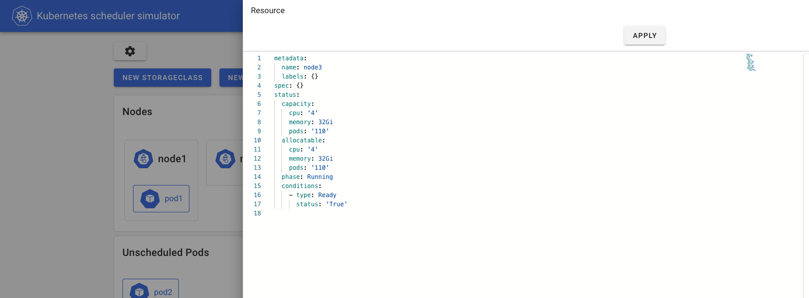

# Kubernetes scheduler simulator

Hello world. Here is Kubernetes scheduler simulator.

Nowadays, the scheduler is configurable/extendable in the multiple ways:
- configure with [KubeSchedulerConfiguration](https://kubernetes.io/docs/reference/scheduling/config/)
- add Plugins of [Scheduling Framework](https://kubernetes.io/docs/concepts/scheduling-eviction/scheduling-framework/)
- add [Extenders](https://github.com/kubernetes/enhancements/tree/5320deb4834c05ad9fb491dcd361f952727ece3e/keps/sig-scheduling/1819-scheduler-extender)
- etc...

But, unfortunately, not all configurations/expansions yield good results.
Those who customize the scheduler need to make sure their scheduler is working as expected,
and doesn't have an unacceptably negative impact on the scheduling.

In real Kubernetes, we cannot know the results of scheduling in detail without reading the logs,
which usually requires privileged access to the control plane.

That's why we are developing a simulator for kube-scheduler
-- you can try out the behavior of the scheduler while checking which plugin made what decision for which Node.

## Simulator's architecture

We have several components:
- Simulator (in `/simulator`): the core implementation of the simulator
- Web UI (in `/web`): the Web client of the simulator
- Coming soon... :)  (see [./keps](./keps) to see some nice ideas we're working on)

### Simulator

Simulator is kube-apiserver + scheduler + the HTTP server which mainly for the web UI.

There are several ways to integrate your scheduler into the simulator.
See [integrate-your-scheduler.md](simulator/docs/integrate-your-scheduler.md).

You can create any resources by communicating with kube-apiserver in any ways (kubectl, k8s client library, or web UI described next)
and see how scheduling is done.

When you create Pods, Pods will get annotations from the simulator which contains the scheduling results per plugins or extenders.

```yaml
kind: Pod
apiVersion: v1
metadata:
  name: hoge-pod
  annotations:
    scheduler-simulator/bind-result: '{"DefaultBinder":"success"}'
    scheduler-simulator/filter-result: >-
      {"node-282x7":{"AzureDiskLimits":"passed","EBSLimits":"passed","GCEPDLimits":"passed","InterPodAffinity":"passed","NodeAffinity":"passed","NodeName":"passed","NodePorts":"passed","NodeResourcesFit":"passed","NodeUnschedulable":"passed","NodeVolumeLimits":"passed","PodTopologySpread":"passed","TaintToleration":"passed","VolumeBinding":"passed","VolumeRestrictions":"passed","VolumeZone":"passed"},"node-gp9t4":{"AzureDiskLimits":"passed","EBSLimits":"passed","GCEPDLimits":"passed","InterPodAffinity":"passed","NodeAffinity":"passed","NodeName":"passed","NodePorts":"passed","NodeResourcesFit":"passed","NodeUnschedulable":"passed","NodeVolumeLimits":"passed","PodTopologySpread":"passed","TaintToleration":"passed","VolumeBinding":"passed","VolumeRestrictions":"passed","VolumeZone":"passed"}}
    scheduler-simulator/finalscore-result: >-
      {"node-282x7":{"ImageLocality":"0","InterPodAffinity":"0","NodeAffinity":"0","NodeNumber":"0","NodeResourcesBalancedAllocation":"76","NodeResourcesFit":"73","PodTopologySpread":"200","TaintToleration":"300","VolumeBinding":"0"},"node-gp9t4":{"ImageLocality":"0","InterPodAffinity":"0","NodeAffinity":"0","NodeNumber":"0","NodeResourcesBalancedAllocation":"76","NodeResourcesFit":"73","PodTopologySpread":"200","TaintToleration":"300","VolumeBinding":"0"}}
    scheduler-simulator/permit-result: '{}'
    scheduler-simulator/permit-result-timeout: '{}'
    scheduler-simulator/postfilter-result: '{}'
    scheduler-simulator/prebind-result: '{"VolumeBinding":"success"}'
    scheduler-simulator/prefilter-result: '{}'
    scheduler-simulator/prefilter-result-status: >-
      {"InterPodAffinity":"success","NodeAffinity":"success","NodePorts":"success","NodeResourcesFit":"success","PodTopologySpread":"success","VolumeBinding":"success","VolumeRestrictions":"success"}
    scheduler-simulator/prescore-result: >-
      {"InterPodAffinity":"success","NodeAffinity":"success","NodeNumber":"success","PodTopologySpread":"success","TaintToleration":"success"}
    scheduler-simulator/reserve-result: '{"VolumeBinding":"success"}'
    scheduler-simulator/result-history: >-
      [{"noderesourcefit-prefilter-data":"{\"MilliCPU\":100,\"Memory\":17179869184,\"EphemeralStorage\":0,\"AllowedPodNumber\":0,\"ScalarResources\":null}","scheduler-simulator/bind-result":"{\"DefaultBinder\":\"success\"}","scheduler-simulator/filter-result":"{\"node-282x7\":{\"AzureDiskLimits\":\"passed\",\"EBSLimits\":\"passed\",\"GCEPDLimits\":\"passed\",\"InterPodAffinity\":\"passed\",\"NodeAffinity\":\"passed\",\"NodeName\":\"passed\",\"NodePorts\":\"passed\",\"NodeResourcesFit\":\"passed\",\"NodeUnschedulable\":\"passed\",\"NodeVolumeLimits\":\"passed\",\"PodTopologySpread\":\"passed\",\"TaintToleration\":\"passed\",\"VolumeBinding\":\"passed\",\"VolumeRestrictions\":\"passed\",\"VolumeZone\":\"passed\"},\"node-gp9t4\":{\"AzureDiskLimits\":\"passed\",\"EBSLimits\":\"passed\",\"GCEPDLimits\":\"passed\",\"InterPodAffinity\":\"passed\",\"NodeAffinity\":\"passed\",\"NodeName\":\"passed\",\"NodePorts\":\"passed\",\"NodeResourcesFit\":\"passed\",\"NodeUnschedulable\":\"passed\",\"NodeVolumeLimits\":\"passed\",\"PodTopologySpread\":\"passed\",\"TaintToleration\":\"passed\",\"VolumeBinding\":\"passed\",\"VolumeRestrictions\":\"passed\",\"VolumeZone\":\"passed\"}}","scheduler-simulator/finalscore-result":"{\"node-282x7\":{\"ImageLocality\":\"0\",\"InterPodAffinity\":\"0\",\"NodeAffinity\":\"0\",\"NodeNumber\":\"0\",\"NodeResourcesBalancedAllocation\":\"76\",\"NodeResourcesFit\":\"73\",\"PodTopologySpread\":\"200\",\"TaintToleration\":\"300\",\"VolumeBinding\":\"0\"},\"node-gp9t4\":{\"ImageLocality\":\"0\",\"InterPodAffinity\":\"0\",\"NodeAffinity\":\"0\",\"NodeNumber\":\"0\",\"NodeResourcesBalancedAllocation\":\"76\",\"NodeResourcesFit\":\"73\",\"PodTopologySpread\":\"200\",\"TaintToleration\":\"300\",\"VolumeBinding\":\"0\"}}","scheduler-simulator/permit-result":"{}","scheduler-simulator/permit-result-timeout":"{}","scheduler-simulator/postfilter-result":"{}","scheduler-simulator/prebind-result":"{\"VolumeBinding\":\"success\"}","scheduler-simulator/prefilter-result":"{}","scheduler-simulator/prefilter-result-status":"{\"InterPodAffinity\":\"success\",\"NodeAffinity\":\"success\",\"NodePorts\":\"success\",\"NodeResourcesFit\":\"success\",\"PodTopologySpread\":\"success\",\"VolumeBinding\":\"success\",\"VolumeRestrictions\":\"success\"}","scheduler-simulator/prescore-result":"{\"InterPodAffinity\":\"success\",\"NodeAffinity\":\"success\",\"NodeNumber\":\"success\",\"PodTopologySpread\":\"success\",\"TaintToleration\":\"success\"}","scheduler-simulator/reserve-result":"{\"VolumeBinding\":\"success\"}","scheduler-simulator/score-result":"{\"node-282x7\":{\"ImageLocality\":\"0\",\"InterPodAffinity\":\"0\",\"NodeAffinity\":\"0\",\"NodeNumber\":\"0\",\"NodeResourcesBalancedAllocation\":\"76\",\"NodeResourcesFit\":\"73\",\"PodTopologySpread\":\"0\",\"TaintToleration\":\"0\",\"VolumeBinding\":\"0\"},\"node-gp9t4\":{\"ImageLocality\":\"0\",\"InterPodAffinity\":\"0\",\"NodeAffinity\":\"0\",\"NodeNumber\":\"0\",\"NodeResourcesBalancedAllocation\":\"76\",\"NodeResourcesFit\":\"73\",\"PodTopologySpread\":\"0\",\"TaintToleration\":\"0\",\"VolumeBinding\":\"0\"}}","scheduler-simulator/selected-node":"node-282x7"}]
    scheduler-simulator/score-result: >-
      {"node-282x7":{"ImageLocality":"0","InterPodAffinity":"0","NodeAffinity":"0","NodeNumber":"0","NodeResourcesBalancedAllocation":"76","NodeResourcesFit":"73","PodTopologySpread":"0","TaintToleration":"0","VolumeBinding":"0"},"node-gp9t4":{"ImageLocality":"0","InterPodAffinity":"0","NodeAffinity":"0","NodeNumber":"0","NodeResourcesBalancedAllocation":"76","NodeResourcesFit":"73","PodTopologySpread":"0","TaintToleration":"0","VolumeBinding":"0"}}
    scheduler-simulator/selected-node: node-282x7
```

You can utilize these results to understand your scheduler, check/test your configurations or customized scheduler's behavior.

Further expansion, you can export internal state more, change specific behaviours on plugins etc by implementing [PluginExtender](./simulator/docs/plugin-extender.md).

The simulator has its own configuration,
you can refer to the [documentation](./simulator/docs/simulator-server-config.md).

See the following docs to know more about simulator:
- [how-it-works.md](simulator/docs/how-it-works.md): describes about how the simulator works.
- [kube-apiserver.md](simulator/docs/kube-apiserver.md): describe about kube-apiserver in simulator. (how you can configure and access)
- [api.md](simulator/docs/api.md): describes about HTTP server the simulator has. (mainly for the webUI)

### Web UI

It's well-optimized Web UI for the simulator.

Web UI is the best way to check the scheduler's behavior very easily.
Nice table view for the scheduling result, the scheduler configuration reload feature, etc...
every core features of the simulator can be access with human-friendly ways!

From the web, you can create/edit/delete these resources to simulate a cluster.

- Nodes
- Pods
- Persistent Volumes
- Persistent Volume Claims
- Storage Classes
- Priority Classes
- Namespaces


It has a cool yaml editor to create/edit resources.



And, after pods are scheduled, you can see the results of

- Each Filter plugins
- Each Score plugins
- Final score (normalized and applied Plugin Weight)


Also, You can change the configuration of the scheduler through [KubeSchedulerConfiguration](https://kubernetes.io/docs/reference/scheduling/config/).

(Note: changes to any fields other than `.profiles` are disabled on simulator, since they do not affect the results of the scheduling.)


Also, you can take a snapshot of the resources so that you can share the situation or load them later.


## Getting started

### Run simulator with Docker

We have [docker-compose.yml](docker-compose.yml) to run the simulator easily. You should install [docker](https://docs.docker.com/engine/install/) and [docker-compose](https://docs.docker.com/compose/install/) firstly.

You can use the following command.

```bash
# build the images for web frontend and simulator server, then start the containers.
make docker_build_and_up
```

Then, you can access the simulator with http://localhost:3000. If you want to deploy the simulator on a remote server and access it via a specific IP (e.g: like http://10.0.0.1:3000/), please make sure that you have executed `export SIMULATOR_EXTERNAL_IP=your.server.ip` before running `docker-compose up -d`.

Note: Insufficient memory allocation may cause problems in building the image.
Please allocate enough memory in that case.

### Run simulator locally

You have to run frontend, server and etcd.

#### 1. Run simulator server and etcd

To run this simulator's server, you have to install Go and etcd.

You can install etcd with [kubernetes/kubernetes/hack/install-etcd.sh](https://github.com/kubernetes/kubernetes/blob/master/hack/install-etcd.sh).

```bash
cd simulator
make start
```

It starts etcd and simulator-server locally.

#### 2. Run simulator frontend

To run the frontend, please see [README.md](web/README.md) on ./web dir.

## Beta features

### [Beta] Importing cluster's resources 

The simulator can import resources from your cluster.

To use this, you need to follow these two step
- Set to `true` the `ExternalImportEnabled` value in the simulator server configuration.
- Set the path of the kubeconfig file of the your cluster to `KubeConfig` value in the Simulator Server Configuration.

See also [simulator/config/config.go](simulator/config/config.go).

## Contributing

see [CONTRIBUTING.md](CONTRIBUTING.md)

## Community, discussion, contribution, and support

Learn how to engage with the Kubernetes community on the [community page](http://kubernetes.io/community/).

You can reach the maintainers of this project at:

- [Slack](http://slack.k8s.io/)
- [Mailing List](https://groups.google.com/forum/#!forum/kubernetes-dev)

### Code of conduct

Participation in the Kubernetes community is governed by the [Kubernetes Code of Conduct](code-of-conduct.md).

[owners]: https://git.k8s.io/community/contributors/guide/owners.md
[creative commons 4.0]: https://git.k8s.io/website/LICENSE
