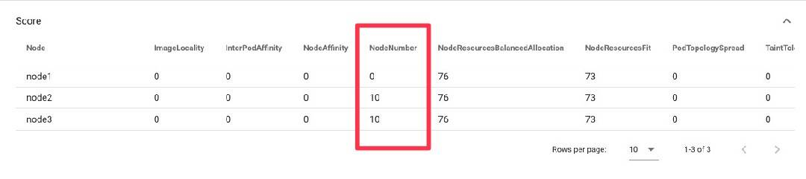

# How to use your custom plugins in the simulator

This doc describes how to use your custom plugins in the simulator.

## 1. Add your custom plugin's registry in OutOfTreeRegistries function.

Please add your custom plugin's registry in `OutOfTreeRegistries` function in config package here:

[kube-scheduler-simulator/scheduler/config/plugin.go](../../config/plugin.go)


## 2. Add your custom plugin in OutOfTreeFilterPlugins or OutOfTreeScorePlugins function.

**Only `Filter` and `Score` plugins**

Please add your custom plugin in `OutOfTreeFilterPlugins` function or `OutOfTreeScorePlugins` function in config package here:

[kube-scheduler-simulator/scheduler/config/plugin.go](../../config/plugin.go)

## 3. Configure the scheduler to enable your custom plugin 

You can configure the scheduler to use your custom plugins through KubeSchedulerConfiguration.

[Scheduler Configuration | Kubernetes](https://kubernetes.io/docs/reference/scheduling/config/)

You can change the scheduler configuration in Web UI or by passing a KubeSchedulerConfiguration file via the environment variable `KUBE_SCHEDULER_CONFIG_PATH`.

## Example

We will explain the case where you want to add [nodenumber](nodenumber/plugin.go) plugin as example.

The nodenumber plugin is an example plugin that favors nodes that have the number suffix which is the same as the number suffix of the pod name.
And we can configure it via `NodeNumberArgs`.

First, we need to add registry for the nodenumber plugin to `OutOfTreeRegistries`.

```go
func OutOfTreeRegistries() runtime.Registry {
	return runtime.Registry{
		// Note: add your original score plugins registries here.
		nodenumber.Name: nodenumber.New,
	}
}
```

Next, add nodenumber to `OutOfTreeScorePlugins` since the nodenumber plugin is a Score plugin.

```go
func OutOfTreeScorePlugins() []v1beta2.Plugin {
	return []v1beta2.Plugin{
		// Note: add your original score plugins here.
		{
			Name:   nodenumber.Name,
		},
	}
}
```

Yes! Now we can use the nodenumber plugin in the simulator!

If you apply this configuration to the scheduler, you can see the nodenumber plugin is working (and NodeNumberArgs is applied to the nodenumber plugin) in the simulator,
and see the nodenumber plugin's result like other in-tree plugins.

```yaml
kind: KubeSchedulerConfiguration
apiVersion: kubescheduler.config.k8s.io/v1beta2
profiles:
  - schedulerName: default-scheduler
    plugins:
      queueSort:
        enabled:
          - name: PrioritySort
      preFilter:
        enabled:
          - name: NodeResourcesFit
          - name: NodePorts
          - name: VolumeRestrictions
          - name: PodTopologySpread
          - name: InterPodAffinity
          - name: VolumeBinding
          - name: NodeAffinity
      filter:
        enabled:
          - name: NodeUnschedulable
          - name: NodeName
          - name: TaintToleration
          - name: NodeAffinity
          - name: NodePorts
          - name: NodeResourcesFit
          - name: VolumeRestrictions
          - name: EBSLimits
          - name: GCEPDLimits
          - name: NodeVolumeLimits
          - name: AzureDiskLimits
          - name: VolumeBinding
          - name: VolumeZone
          - name: PodTopologySpread
          - name: InterPodAffinity
      postFilter:
        enabled:
          - name: DefaultPreemption
      preScore:
        enabled:
          - name: InterPodAffinity
          - name: PodTopologySpread
          - name: TaintToleration
          - name: NodeAffinity
          - name: NodeNumber
      score:
        enabled:
          - name: NodeResourcesBalancedAllocation
            weight: 1
          - name: ImageLocality
            weight: 1
          - name: InterPodAffinity
            weight: 1
          - name: NodeResourcesFit
            weight: 1
          - name: NodeAffinity
            weight: 1
          - name: PodTopologySpread
            weight: 2
          - name: NodeNumber
            weight: 10
          - name: TaintToleration
            weight: 1
      reserve:
        enabled:
          - name: VolumeBinding
      permit: {}
      preBind:
        enabled:
          - name: VolumeBinding
      bind:
        enabled:
          - name: DefaultBinder
      postBind: {}
    pluginConfig:
      - name: DefaultPreemption
        args:
          kind: DefaultPreemptionArgs
          apiVersion: kubescheduler.config.k8s.io/v1beta2
          minCandidateNodesPercentage: 10
          minCandidateNodesAbsolute: 100
      - name: InterPodAffinity
        args:
          kind: InterPodAffinityArgs
          apiVersion: kubescheduler.config.k8s.io/v1beta2
          hardPodAffinityWeight: 1
      - name: NodeAffinity
        args:
          kind: NodeAffinityArgs
          apiVersion: kubescheduler.config.k8s.io/v1beta2
      - name: NodeResourcesBalancedAllocation
        args:
          kind: NodeResourcesBalancedAllocationArgs
          apiVersion: kubescheduler.config.k8s.io/v1beta2
          resources:
            - name: cpu
              weight: 1
            - name: memory
              weight: 1
      - name: NodeResourcesFit
        args:
          kind: NodeResourcesFitArgs
          apiVersion: kubescheduler.config.k8s.io/v1beta2
          scoringStrategy:
            type: LeastAllocated
            resources:
              - name: cpu
                weight: 1
              - name: memory
                weight: 1
      - name: PodTopologySpread
        args:
          kind: PodTopologySpreadArgs
          apiVersion: kubescheduler.config.k8s.io/v1beta2
          defaultingType: System
      - name: VolumeBinding
        args:
          kind: VolumeBindingArgs
          apiVersion: kubescheduler.config.k8s.io/v1beta2
          bindTimeoutSeconds: 600
      - name: NodeNumber
        args:
          kind: NodeNumberArgs
          apiVersion: kubescheduler.config.k8s.io/v1beta2
          reverse: true
```

