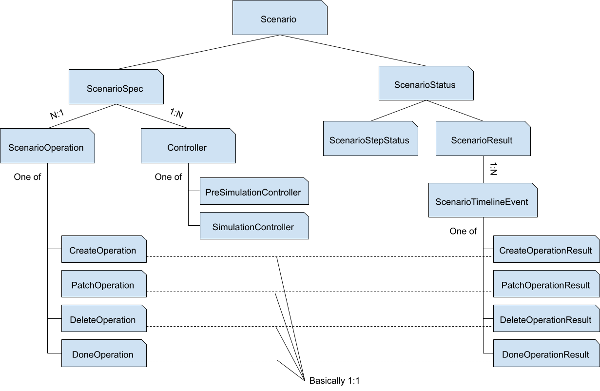
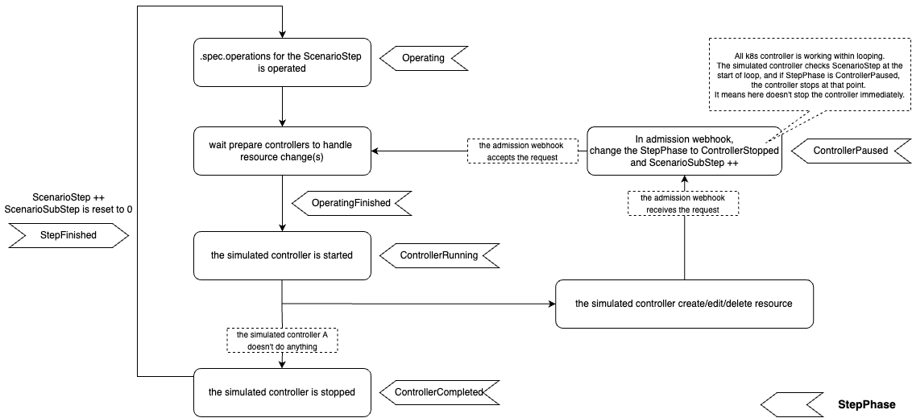
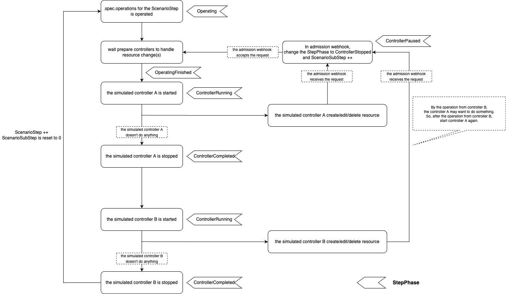

# KEP-140: Scenario-based simulation

## Summary

A new scenario-based simulation feature is introduced to kube-scheduler-simulator by the new `Scenario` CRD.

## Motivation

Nowadays, the scheduler is extendable in multiple ways:
- configure with [KubeSchedulerConfiguration](https://kubernetes.io/docs/reference/scheduling/config/)
- add Plugins of [Scheduling Framework](https://kubernetes.io/docs/concepts/scheduling-eviction/scheduling-framework/)
- add [Extenders](https://github.com/kubernetes/enhancements/tree/5320deb4834c05ad9fb491dcd361f952727ece3e/keps/sig-scheduling/1819-scheduler-extender)
- etc...

But unfortunately, not all expansions yield good results.
Those who customize the scheduler need to ensure it is working as expected and doesn't have an unacceptably negative impact on the scheduling result or performance. And usually, evaluating the scheduler is not easy because there are many factors for evaluating the scheduler's ability.

The scenario-based simulation feature will be helpful for those who customize the scheduler to evaluate their scheduler.

## Goals

Users can simulate their controller, including the scheduler, with defined scenarios and evaluate their controller's behavior.
It's mainly designed for the scheduler, but you can use it for other controllers like a cluster autoscaler.

## Non-Goals

See the result of scenario-based simulation from Web UI. (maybe implemented in the future, but out of the scope of this proposal.)

## User Stories 

### Story 1

The company has added many features into the scheduler via some custom plugins,
and they want to make sure that their expansions are working as expected and have not negatively impacted the scheduling results.

#### Solution

They can define appropriate scenarios and analyze the .status.result with the result calculation package.

### Story 2

The users want to see how their customized scheduler behaves in the worst case scenario.

#### Solution

Even when a scenario is running, users can add operations to that scenario. 
So, in this case, they can add operations that are worst case for the scheduler by looking at the simulation results and the resources status at that point.

## Proposal

### Implementation design details

#### The current simulator and proposal

We initially designed the simulator with a strong emphasis on Web UI. 
Then, thanks to so many contributions from everyone, we've expanded the simulator to be able to be used by other clients like kubectl, client-go, etc.

Now that simulators are no longer just for WebUI, we need to think about how we can design scenario-based simulations to be easy to use by other clients as well.

Therefore, this kep proposes to define the scenario **as CRD**. All clients, including web UI, can use the scenario-based simulation feature by creating the Scenario resource.

#### Scenario CRD

The Scenario is a non-namespaced resource. 
This CRD will be applied to kube-apiserver started in kube-scheduler-simulator.

The following diagram depicts the high-level relationship among entities in `Scenario` CRD.



We may need to change etcd request-size limitation by --max-request-bytes since the scenario resource may be more significant than other standard resources.
https://etcd.io/docs/v3.4/dev-guide/limit/#request-size-limit

```go
// ScenarioSpec defines the desired state of Scenario
type ScenarioSpec struct {
	// Operations field has all operations for a scenario.
	// Also, you can add a new operation while the scenario runs.
	//
	// +patchMergeKey=ID
	// +patchStrategy=merge
	Operations []*ScenarioOperation `json:"operations"`

	// Controllers have the configuration for controllers working with simulation.
	Controllers *Controllers `json:"controllers"`
}

// See [# SimulationControllers and PreSimulationControllers](#simulationcontrollers-and-presimulationcontrollers).
type Controllers struct {
	// PreSimulationControllers is a list of controllers that should be run before SimulationControllers.
	// They will run in parallel.
	// 
	// It's an optional field. 
	// All controllers registered in the simulator will be enabled automatically. (except controllers set in Simulate.)
	// So, you need to configure it only when you want to disable some controllers enabled by default.
	//
	// +optional
	PreSimulationControllers	*ControllerSet `json:"presimulationControllers`
	// SimulationControllers is a list of controllers that are the target of this simulation.
	// These are run one by one in the same order specified in Enabled field.
	// 
	// It's a required field; no controllers will be enabled automatically.
	SimulationControllers  *ControllerSet `json:"simulationControllers"`
}

type ControllerSet struct {
	// Enabled specifies controllers that should be enabled.
	// +listType=atomic
	Enabled  []Controller `json:"enabled"`
	// Disabled specifies controllers that should be disabled.
	// When all controllers need to be disabled, an array containing only one "*" should be provided.
	// +listType=map
	// +listMapKey=name
	Disabled []Controller `json:"disabled"`
}

type Controller struct {
	Name string
}

type ScenarioOperation struct {
	// ID for this operation. Normally, the system sets this field for you.
	ID string `json:"id"`
	// MajorStep indicates when the operation should be done.
	MajorStep int32 `json:"step"`

	// One of the following four fields must be specified.
	// If more than one is set or all are empty, the operation is invalid, and the scenario will fail.

	// Create is the operation to create a new resource.
	//
	// +optional
	Create *CreateOperation `json:"createOperation,omitempty"`
	// Patch is the operation to patch a resource.
	//
	// +optional
	Patch *PatchOperation `json:"patchOperation,omitempty"`
	// Delete indicates the operation to delete a resource.
	//
	// +optional
	Delete *DeleteOperation `json:"deleteOperation,omitempty"`
	// Done indicates the operation to mark the scenario as Succeeded.
	// When finish the step DoneOperation belongs, this Scenario changes its status to Succeeded.
	//
	// +optional
	Done *DoneOperation `json:"doneOperation,omitempty"`
}

type CreateOperation struct {
	// Object is the Object to be created.
	Object *unstructured.Unstructured `json:"object"`

	// +optional
	CreateOptions metav1.CreateOptions `json:"createOptions,omitempty"`
}

type PatchOperation struct {
	TypeMeta   metav1.TypeMeta   `json:"typeMeta"`
	ObjectMeta metav1.ObjectMeta `json:"objectMeta"`
	// Patch is the patch for target.
	Patch string `json:"patch"`
	// PatchType
	PatchType types.PatchType

	// +optional
	PatchOptions metav1.PatchOptions `json:"patchOptions,omitempty"`
}

type DeleteOperation struct {
	TypeMeta   metav1.TypeMeta   `json:"typeMeta"`
	ObjectMeta metav1.ObjectMeta `json:"objectMeta"`

	// +optional
	DeleteOptions metav1.DeleteOptions `json:"deleteOptions,omitempty"`
}

type DoneOperation struct{}

// See [# The concept "ScenarioStep"](#the-concept-scenariostep).
// ScenarioStep is the time represented by a set of numbers, MajorStep and MinorStep,
// which are like hours and minutes in clocks in the real world.
// ScenarioStep.Major is moved to the next ScenarioStep.Major when the SimulationController can no longer do anything with the current cluster state.
// Scenario.Minor is moved to the next Scenario.Minor when any resources operations(create/edit/delete) happens.
type ScenarioStep struct {
	Major int32 `json:"major"`
	Minor int32 `json:"minor"`
}

// ScenarioStatus defines the observed state of Scenario
type ScenarioStatus struct {
	// The phase is a simple, high-level summary of where the Scenario is in its lifecycle.
	//
	// +optional
	Phase ScenarioPhase `json:"phase,omitempty"`
	// A human-readable message indicating details about why the scenario is in this phase.
	//
	// +optional
	Message *string `json:"message,omitempty"`
	// StepStatus has the status related to step.
	//
	StepStatus ScenarioStepStatus `json:"stepStatus"`
	// ScenarioResult has the result of the simulation.
	// Just before Step advances, this result is updated based on all occurrences at that step.
	//
	// +optional
	ScenarioResult ScenarioResult `json:"scenarioResult,omitempty"`
}

type ScenarioStepStatus struct {
	// Step indicates the current ScenarioStep.
	//
	// +optional
	Step ScenarioStep `json:"step,omitempty"`
	// Phase indicates the current phase in a single step.
	// 
	// +optional
	Phase StepPhase `json:"phase,omitempty"`
	// RunningSimulationController indicates one of the SimulationControllers that is currently running/paused/completed.
	RunningSimulationController string `json:"runningSimulationController"`
}

type StepPhase string

const (
	// Operating means controller is currently operating operation defined for the step.
	Operating StepPhase = "Operating"
	// OperatingCompleted means the PreSimulationControllers have finished operating operation defined for the step.
	OperatingCompleted StepPhase = "OperatingCompleted"
	// ControllerRunning means the SimulationController is working.
	ControllerRunning StepPhase = "ControllerRunning"
	// ControllerPaused means the SimulationController is paused(or will be paused).
	ControllerPaused	StepPhase = "ControllerPaused"
	// ControllerCompleted means the current running SimulationController no longer do anything with the current cluster state.
	ControllerCompleted StepPhase = "ControllerCompleted"
	// StepCompleted means the controller is preparing to move to the next step.
	StepCompleted StepPhase = "Finished"
)

type ScenarioPhase string

const (
	// ScenarioPending phase indicates the scenario isn't started yet.
	// e.g., waiting for another scenario to finish running.
	ScenarioPending ScenarioPhase = "Pending"
	// ScenarioRunning phase indicates the scenario is running.
	ScenarioRunning ScenarioPhase = "Running"
	// ScenarioPaused phase indicates all ScenarioSpec.Operations
	// has been finished but not marked as done by ScenarioDone ScenarioOperations.
	ScenarioPaused ScenarioPhase = "Paused"
	// ScenarioSucceeded phase describes Scenario is fully completed
	// by ScenarioDone ScenarioOperations. User
	// can’t add any ScenarioOperations once
	// Scenario reached this phase.
	ScenarioSucceeded ScenarioPhase = "Succeeded"
	// ScenarioFailed phase indicates something wrong happened while running the scenario.
	// For example:
	// - the controller cannot create a resource for some reason.
	// - users change the scheduler configuration via simulator API.
	ScenarioFailed  ScenarioPhase = "Failed"
	ScenarioUnknown ScenarioPhase = "Unknown"
)

type ScenarioResult struct {
	// SimulatorVersion represents the version of the simulator that runs this scenario.
	SimulatorVersion string `json:"simulatorVersion"`
	// Timeline is a map of operations keyed with MajorStep(string).
	// This may have many of the same operations as .spec.operations but has additional PodScheduled and Delete operations for Pods
	// to represent a Pod is scheduled or preempted by the scheduler.
	//
	// +patchMergeKey=ID
	// +patchStrategy=merge
	Timeline map[string][]ScenarioTimelineEvent `json:"timeline"`
}

type ScenarioTimelineEvent struct {
	// The ID will be the same as spec.ScenarioOperations.ID if it is from the defined operation.
	// Otherwise, it'll be newly generated.
	ID string
	// Step indicates the ScenarioStep at which the operation has been done.
	Step	ScenarioStep `json:"step"`

	// Only one of the following fields must be non-empty.

	// Create is the result of ScenarioSpec.Operations.CreateOperation.
	Create *CreateOperationResult `json:"create"`
	// Patch is the result of ScenarioSpec.Operations.PatchOperation.
	Patch *PatchOperationResult `json:"patch"`
	// Delete is the result of ScenarioSpec.Operations.DeleteOperation.
	Delete *DeleteOperationResult `json:"delete"`
	// Done is the result of ScenarioSpec.Operations.DoneOperation.
	Done *DoneOperationResult `json:"done"`
}

type CreateOperationResult struct {
	// Operation is the operation that was done.
	Operation CreateOperation `json:"operation"`
	// Result is the resource after the creation.
	Result unstructured.Unstructured `json:"result"`
}

type PatchOperationResult struct {
	// Operation is the operation that was done.
	Operation PatchOperation `json:"operation"`
	// Result is the resource after the patch.
	Result unstructured.Unstructured `json:"result"`
}

type DeleteOperationResult struct {
	// Operation is the operation that was done.
	Operation DeleteOperation `json:"operation"`
}

type DoneOperationResult struct {
	// Operation is the operation that was done.
	Operation DoneOperation `json:"operation"`
}

// Scenario is the Schema for the scenario API
type Scenario struct {
	metav1.TypeMeta   `json:",inline"`
	metav1.ObjectMeta `json:"metadata,omitempty"`

	Spec   ScenarioSpec   `json:"spec,omitempty"`
	Status ScenarioStatus `json:"status,omitempty"`
}
```

#### The detailed goal of the scenario

- Users can define Scenario and see how the SimulationControllers work with a scenario.
- Users can analyze and evaluate the controller with .status.Result.Timeline.
	- All operations that happened while running the scenario will be recorded in Timeline and users can analyze Timeline by using our functions.
- The result from the same Scenario won't be much changed run by run.
	- Hopefully, if the Scenario and controllers are the same, the result should be similar. 

#### The required configuration for users

- add the comment directive to all SimulationController's codes and modify the code by our code generator.
  - The simulator has the scheduler internally by default, and this scheduler has already been set up.
  - See [# How to stop the SimulationControllers loop](#how-to-stop-the-simulationcontrollers-loop).
- define the functions for controllers to expect when controllers start to work and when controllers finish working.
  - The simulator has some controllers internally by default, and they have already been set up.
  - See [#How the simulator knows when a cluster state gets converged by the controller?](#how-the-simulator-knows-when-a-cluster-state-gets-converged-by-the-controller).

#### Kubernetes controller

Let's talk about the controllers in Kubernetes first.

> In Kubernetes, controllers are control loops that watch the state of your cluster, then make or request changes where needed. Each controller tries to move the current cluster state closer to the desired state.
https://kubernetes.io/docs/concepts/architecture/controller/

The Kubernetes controller has the desired state.
For example, the ReplicaSet controller. It's working on managing the number of Pods to satisfy all replicaset's `.spec.replicas`.

Some controllers in this world refer to something other than k8s resources like external metrics and real time to determine their ideal state. 
But, they cannot be used in our Scenario. In other words, **controllers that refer only to resources on k8s can be used in Scenario.**
This is because the scenario controller cannot manage something other than k8s resources, and unexpected operations based on them may happen during the Scenario, which we want to avoid.

The following controllers cannot be used in Scenario, for example:
- controllers that use external metrics.
  - e.g., the cluster autoscaler that scales Nodes based on external metrics.
- controllers that do something based on real time.
  - e.g., the cronjob controller that creates Job based on real time.

All controllers that refer only to k8s resources won't do anything if there is no change on k8s resources state.
In other words, all controllers may do something only when someone performs a k8s resource operation.

#### How the simulator knows when a cluster state gets converged by the controller?

In the simulator, users define the `ControllerWaiter` for each controller so that we can expect when a controller finishes working.

```go
// ControllerWaiter is used to know when a cluster state gets converged by the controller.
type ControllerWaiter interface {
	// Name returns the controller's name.
    Name() string
	// WaitConditionFunc returns wait.ConditionFunc that detects when the controller cannot do anything in this cluster state.
    WaitConditionFunc(ctx context.Context) (wait.ConditionFunc, error)
}
```

For example, the ReplicaSet controller. `WaitConditionFunc` returns the `wait.ConditionFunc` that detects 
all replicaset satisfy .spec.replicas == .status.fullyLabeledReplicas (the ideal state for the ReplicaSet controller) or .status.conditions has ReplicaFailure true (cannot do anymore to move the cluster state closer to the ideal state).

Talk about why we need it in the later section.

#### SimulationControllers and PreSimulationControllers

We have two types of controllers; SimulationControllers and PreSimulationControllers.

SimulationControllers are the target of this simulation,
and PreSimulationControllers are the other controllers that are needed to simulate.

Let's say you want to simulate the scheduler and you are going to use ReplicaSet in the simulation. 
In that case, you will set scheduler as SimulationController and ReplicaSet controller as PreSimulationControllers.

#### The concept "ScenarioStep"

The Scenario has the concept "ScenarioStep" to represent the _simulated_ time used during scenario running.
It is not directly related to the real-time that you see in your wall-clock, but is a variable maintained by the scenario controller.

ScenarioStep is represented by a set of numbers, "MajorStep" and "MinorStep", which are like hours and minutes in clocks in the real world.
(Precisely, MajorStep and MinorStep don't have the range limitations that hours and minutes have)

So, ScenarioStep.Major and ScenarioStep.Minor are similar. The difference is who performs the operations. 
- ScenarioStep.Major is incremented just before the scenario controller will perform the next resource operations defined in .spec.Operations.
	- The scenario controller increments it when all SimulationController can no longer do anything with the current cluster state.
- ScenarioStep.Minor is incremented just before the SimulationController will perform resource operations.

#### What happens in a single MajorStep.

The following diagram shows all what happens at a single ScenarioStep:



And if a Scenario has two SimulationControllers, the SimulationController will be run one by one in the same order specified in .spec.controllers.SimulationControllers.enabled field.



Let's go into the details.

##### 1. .spec.operations for the ScenarioStep is operated

ScenarioStep: {X, 0}
StepPhase: Operating

First, the scenario controller operate all .spec.operations for the MajorStep X.

##### 2. wait PreSimulationControllers to handle resource changes

ScenarioStep: {X, 0}
StepPhase: Operating

In [# Kubernetes controller](#Kubernetes-controller) section, we describe it:
> All controllers that refer only to k8s resources won't do anything if there is no change on k8s resources state.
In other words, all controllers may do something only when someone performs a k8s resource operation.

At (1), .spec.operations is performed and PreSimulationControllers may perform some operations to move the current cluster state closer to the desired state.

And **the SimulationControllers need to stop working while the PreSimulationControllers work.** (Actually, the SimulationController has been stopped since (1))
In .status.Result.Timeline, PreSimulationControllers actions are treated as if they were instantaneous.

So, why..? This is because we need to ensure that the simulation results do not vary significantly from run to run. 

For example:
The user has the CRD named "NodeSet". It's like ReplicaSet, but literally, it creates a defined number of Nodes.
Let's say the user wants to simulate the scheduler and defines the operation in the Scenario that creates NodeSet to create 1000 Nodes. Since it is strictly impossible to create 1000 Nodes simultaneously, the scheduler will schedule pending Pods to the Nodes created first. 
And depending on how fast the NodeSet controller creates the 1000 Node, the simulation results will change.
The scheduler needs to be stopped scheduling until the NodeSet controller creates 1000 Nodes so that the speed of the NodeSet controller doesn't affect the simulation result.

##### 3. PreSimulationControllers finish to work 

ScenarioStep: {X, 0}
StepPhase: OperatingCompleted

See [#How the simulator knows when a cluster state gets converged by the controller?](#how-the-simulator-knows-when-a-cluster-state-gets-converged-by-the-controller).

We use `WaitConditionFunc` to wait for all controllers to finish their work to deal with (1).

##### 4. the SimulationController starts

ScenarioStep: {X, 0}
StepPhase: ControllerRunning

The SimulationControllers have been stopped until now.

Here, start one of the SimulationControllers. 
SimulatedControllers is run in the same order specified in .spec.Controllers.SimulationControllers.Enabled field.

##### 5. the SimulationController does operation(s) for k8s resources

ScenarioStep: {X, 0} -> {X, 1}
StepPhase: ControllerRunning -> ControllerPaused

The SimulationController may perform some operations for k8s resources.
In admission webhook, we change the StepPhase to ControllerPaused and increment MinorStep. (Then, the requests are accepted.)

##### 6. the SimulationController stops working

ScenarioStep: {X, 1}
StepPhase: ControllerPaused

In [# Kubernetes controller](#Kubernetes-controller) section, we see the controllers are working in **loops**.

> In Kubernetes, controllers are control loops that watch the state of your cluster, then make or request changes where needed. Each controller tries to move the current cluster state closer to the desired state.
https://kubernetes.io/docs/concepts/architecture/controller/

The SimulationController always checks ScenarioStep at the end of its loop. And if StepPhase is ControllerPaused, the controller stops working. 

StepPhase was changed to ControllerPaused at (5), and the SimulationController should be stopped at the end of that loop.

See also [# How to stop the SimulationControllers loop](#how-to-stop-the-simulationcontrollers-loop).

##### 7. wait PreSimulationControllers to handle resource changes

ScenarioStep: {X, 1}
StepPhase: ControllerPaused

The PreSimulationControllers may work when the SimulationControllers perform some operations on k8s resources. 

So, every time the working SimulationController performs operations, we need to wait for the PreSimulationControllers to handle resource changes like (2).

It will repeat from (3) to (7) until the SimulationController can no longer do anything with the current cluster state.

##### 8. the SimulationController can no longer do anything with the current cluster state

ScenarioStep: {X, Y} 
StepPhase: ControllerRunning -> ControllerCompleted

We use `WaitConditionFunc` of the SimulationController to detect this (like at (3)).
The SimulationController stops working again like at (6).

After ControllerCompleted, the next SimulationController is started. 
And it will repeat from (4) to (8). 

##### 9. all the SimulationController can no longer do anything with the current cluster state

ScenarioStep: {X, Z}
StepPhase: ControllerCompleted -> StepCompleted

Yey! The simulation in the single MajorStep is finished!

Increment ScenarioMajorStep and reset ScenarioMinorStep to 0.

#### How to stop the SimulationControllers loop

In [# Kubernetes controller](#Kubernetes-controller) section, we see the controllers are working in **loops**.

> In Kubernetes, controllers are control loops that watch the state of your cluster, then make or request changes where needed. Each controller tries to move the current cluster state closer to the desired state.
https://kubernetes.io/docs/concepts/architecture/controller/

It's required to add the function `CheckScenarioStepPhase()` to all SimulationControllers, that stops the SimulationControllers loop when a running Scenario wants.

The following is an example for super simplified implementation of controllers.
`CheckScenarioStepPhase()` needs to be added at the end of loop.

```go
// Run runs HogeController.
func (h *HogeController) Run() {
	for {
		runOnce()
	}
}

// runOnce checks the cluster state and move the current cluster state closer to the desired state.
func (h *HogeController) runOnce() {
	defer scenario.CheckScenarioStepPhase("hoge-controller", config) // config: *(k8s.io/client-go/rest).Config to be used to connect kube-apiserver in the simulator.
}
```

The function `scenario.CheckScenarioStepPhase()` is always executed at the end of `runOnce`, and checks the running Scenario's .status.stepStatus.phase and .status.stepStatus.runningSimulationController. 
And when .status.stepStatus.phase is ControllerPaused and .status.stepStatus.runningSimulationController is "hoge-controller", it is blocked at that point until .status.stepStatus.phase becomes OperatingCompleted.

See the diagram in [the previous section](#the-concept-scenariostep), when the hoge-controller performs some operation for k8s resources, the admission webhook will change .status.stepStatus.phase to ControllerPaused. Then `scenario.CheckScenarioStepPhase` will be executed at the end of `runOnce` and the hoge-controller will stop looping.

Note: Even if multiple k8s resource operations happen in a single `runOnce`, the controller will stop at the end of `runOnce`.

#### The result calculation packages

ScenarioResult only has the simple data that represent what happens during the scenario.

So, we will provide useful functions and data structures to analyze the result. 

Here is the example ideas:
- the function to aggregate scheduling results from Pod's annotations.
	- the simulator records the scheduling results in Pod's annotation.
- the function to aggregate changes in allocation rate of the entire cluster.
- the function to aggregate changes in resource utilization for each Node.
- the generic iterator function that users can aggregate custom values.
- (Do you have any other idea? Tell us!)

By putting only the minimum simple information in ScenarioResult and providing functions to change it into a user-friendly struct, we can support many data structures without any changes to Scenario API.

#### Adding operations to running Scenario 

It is allowed to add operations while the Scenario is running.

Note that it does not make sense to add past ScenarioStep operations.
And, it is strongly recommended to add operations to running Scenario only after Scenario has reached "Paused" ScenarioPhase because ScenarioStep always continues to move forward until it has reached "Paused" ScenarioPhase.
Otherwise, you may add the past ScenarioStep operations, which are ignored by running Scenario.

#### Configure when to update ScenarioResult

The scenario controller only updates status.scenarioResult in Scenario resource when proceeding to the next ScenarioStep.
This is because kube-apiserver will be so busy if the controller update status.scenarioResult everytime it updated,
especially when the size of Scenario is so big.

> etcd is designed to handle small key value pairs typical for metadata. Larger requests will work, but may increase the latency of other requests. By default, the maximum size of any request is 1.5 MiB. This limit is configurable through --max-request-bytes flag for etcd server.
https://etcd.io/docs/v3.4/dev-guide/limit/#request-size-limit

For example, when using Scenario for accurate benchmark testing, users may want to reduce the request to update Scenario for kube-apiserver as much as possible.

We can add a new configuration environment variable `UPDATE_SCENARIO_RESULTS_STRATEGY` and define some strategies like:
- `UPDATE_SCENARIO_RESULTS_STRATEGY=AtMovingNextStep`: It's default value. update status.scenarioResult in Scenario resource when proceeding to the next ScenarioStep.
- `UPDATE_SCENARIO_RESULTS_STRATEGY=OnPause`: update status.scenarioResult in Scenario resource when the Scenario's phase becomes `Paused`, `Succeeded` or `Failed`.
- `UPDATE_SCENARIO_RESULTS_STRATEGY=OnDone`: update status.scenarioResult in Scenario resource when the Scenario's phase becomes `Succeeded` or `Failed`.

We can discuss it after all the implementation of Scenario is done.

#### The case kube-apiserver has Scenarios when the scenario controller starts to run

When the scenario controller is started and finds the Scenario which phase is "Running", the controller changes the status "Failed" with updating the `.status.message` like "the controller restarted while the Scenario was running".

#### Prohibitions and restrictions

The scenarios run one by one, and multiple scenarios are never run simultaneously. 
That means the scenario controller will run the following Scenario after the current running Scenario becomes "Failed" or "Succeeded".

In addition, the following actions are prohibited during scenario execution. The scenario result will be unstable or invalid if these actions are performed.
- change the scheduler configuration via simulator API.
- create/delete/edit any resources manually.

And all resources created before starting a scenario are deleted at the start of the scenario,
so that they don't affect the simulation results.
