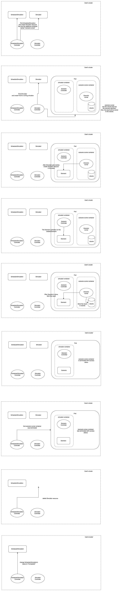

# KEP-184: Scheduler Simulation

## Summary

A new `SchedulerSimulation` CRD and controller are implemented. 

`SchedulerSimulation` allows users to use `Simulator` for one-shot `Scenario`-based scheduler simulation.
(`Scenario` is the CRD to run scenario-based simulation introduced in KEP-140,
and `Simulator` is the CRD to create simulator as Pod introduced in KEP-167.)

## Motivation

With `Scenario` introduced in KEP-140, we can define scenarios and see how the scheduler behaves.

But, we cannot define "which scheduler will do it" in `Scenario`. 
It can't be helped because only one scheduler is running in a simulator and `Scenario` resource is created in a simulator.

Wouldn't it be nice to be able to run the same scenario with various schedulers and see which scheduler is the best one? Yes. That's one of the motivations. 

### Goals

- In `SchedulerSimulation` resource, users can define the `Scenario` and the `Simulator`'s spec which run that `Scenario`. 
- `SchedulerSimulation` resources (precisely the controller for `SchedulerSimulation`) will create the `Simulator` resource to run a simulator and run the `Scenario` in that simulator.

### Non-Goals

Create `SchedulerSimulation` in Web UI. (may be implemented in the future, but out of scope of this proposal.)

## Proposal

### Implementation design details

#### Required prior knowledge

The `Scenario` is the CRD to run scenario-based simulation introduced in KEP-140.
It is applied to kube-apiserver started in kube-scheduler-simulator, (all simulator has own kube-apiserver internally.)
and a scenario is start to running just after created.

The `Simulator` is the CRD to run the simulator as Pod in the cluster introduced in KEP-167.
It is applied to user's cluster (not to kube-apiserver started in a simulator.)

#### SchedulerSimulation CRD

The CRD `SchedulerSimulation` will be applied to kube-apiserver in user's cluster. (not to simulator's kube-apiserver.) 

It's namespaced resource. 

```go
type SchedulerSimulation struct {
  metav1.TypeMeta 
  metav1.ObjectMeta // namespaced.

  Spec SchedulerSimulationSpec
  Status SchedulerSimulationStatus
}
  
type SchedulerSimulationSpec struct {
  // Describes the simulator that will be created.
  // Cannot be updated.
  SimulatorSpec SimulatorSpec
  // ScenarioTemplateFilePath represents the path for file that has the Scenario resource's definition.
  // The Scenario defined in the file will be run in the simulator.
  //
  // It should be the path for the mounted path in most cases,
  // otherwise, the scenario won't created successfully.
  //
  // Cannot be updated.
  ScenarioTemplateFilePath string 
  // ScenarioResultFilePath represents the file path that the result of scenario will be stored.
  // 
  // It should be the path for the mounted path in most cases,
  // otherwise, the simulation result won't stored to the persistent file.
  //
  // Cannot be updated.
  ScenarioResultFilePath string
  // Volume to be mounted.
  //
  // The container named "scenario-runner" will be created in the simulator Pod.
  // That container will see the scenario defined in ScenarioTemplateFilePath, create the scenario in the simulator, and store the result into ScenarioReusltFilePath.
  // The volume specified here is mounted as mountPath `/mnt` in that container.
  //
  // More info about volume: https://kubernetes.io/docs/concepts/storage/volumes
  //
  // Cannot be updated.
  Volume corev1.Volume 
  // ScenarioRunnerImage is the image for the container named "scenario-runner" that will be created in the simulator Pod.
  // That container will see the scenario defined in ScenarioTemplateFilePath, create the scenario in the simulator, and store the result into ScenarioReusltFilePath.
  //
  // Default value is [TODO: provide the image of "scenario-runner" and write the image name here]
  // Cannot be updated.
  ScenarioRunnerImage corev1.Image
}

type SchedulerSimulationStatus struct {
  Phase SchedulerSimulationPhase

  // Represents time when the simulation controller started processing a job. 
  // It is represented in RFC3339 form and is in UTC.
  // +optional
  StartTime *metav1.Time 

  // Represents time when the simulation was completed. It is not guaranteed to
  // be set in happens-before order across separate operations.
  // It is represented in RFC3339 form and is in UTC.
  // The completion time is only set when the job finishes successfully.
  // +optional
  CompletionTime *metav1.Time 

  // A human readable message indicating details about why the simulation is in this phase.
  // optional
  Message *string 
}

type SchedulerSimulationPhase string
const (
  // SchedulerSimulationFailed means the job has failed its execution.
  SchedulerSimulationFailed SchedulerSimulationPhase = "Failed"
  // SchedulerSimulationCompleted means the simulation has completed its execution.
  SchedulerSimulationCompleted SchedulerSimulationPhase = "Completed"
)
```

#### Scenario runner container

The container named "scenario-runner" will be created in the simulator Pod(= the Pod created by `Simulator` resource). 
That container will fetch the `Scenario` defined in ScenarioTemplateFilePath, create the `Scenario` in the simulator, and store the result into ScenarioResultFilePath.

The volume specified in Volume and VolumeMount fields is mounted in that container.

So, the simulator Pod created for SchedulerSimulation with scenario-runner container will be like:

```yaml
  containers:
  # other containers definition....

  - name: scenario-runner
    image: # spec.ScenarioRunnerImage image here. 
    env:
    - name: SIMULATOR_KUBE_APISERVER_PORT # need to pass kube-apiserver port via env or command argument so that scenario-runner can access kube-apiserver in the simulator.
      value: 9999 # read from spec.SimulatorSpec.KubeAPIServerPort here.
    volumeMounts: # read from spec.VolumeMounts.
  volume: # read from spec.Volume.
```

#### SchedulerSimulation execution flow

0. User creates SchedulerSimulation resource in user's cluster.
1. The SchedulerSimulation controller creates a Simulator resource with "scenario-runner" container.
2. After the Pod gets started, the "scenario-runner" reads ScenarioTemplateFile and creates the Scenario resource in simulator's kube-apiserver.
3. The simulator run the scenario.
4. After the scenario is done, the "scenario-runner" fetch the Scenario's result from simulator's kube-apiserver and store it in ScenarioResultFile.
5. The "scenario-runner" container is terminated.
6. The SchedulerSimulation controller deletes the Simulator resource.
7. The controller changes the status of SchedulerSimulation to "Completed"

---



#### Why input the scenario and output the result are via file

The etcd has the size limitation against resource and if you are concerned about this, use ScenarioTemplateFile instead.
https://etcd.io/docs/v3.4/dev-guide/limit/#request-size-limit

> etcd is designed to handle small key value pairs typical for metadata. Larger requests will work, but may increase the latency of other requests. By default, the maximum size of any request is 1.5 MiB. This limit is configurable through --max-request-bytes flag for etcd server.

Unlike `Scenario` CRD, which is applied to simulator's kube-apiserver, `SchedulerSimulation` CRD is applied to kube-apiserver in user's cluster,
and we should not have a negative impact on kube-apiserver in user's cluster.

### User Stories 

#### Story 1

The company has added many features into scheduler via some custom plugins, 
and they want to make sure that their implementation changes for the plugins are working as expected and has not negatively impacted the scheduling results in the CI.

##### Solution

They can run the simulation by creating SchedulerSimulation resources in CI.
By analyzes the results from SchedulerSimulation and calculates a score from some point of view, they can see the impact of that implementation change in CI and evaluate their implemantation changes.

## Alternatives

### Including Scenario field in SchedulerSimulationSpec

Like:

```go
type SchedulerSimulationSpec struct {
  // Scenario represents the scenario that will be run in the simulator.
  // Note that using both Scenario and ScenarioTemplateFile makes no sense. (Scenario has priority over ScenarioTemplateFile in that case.) 
  // 
  // The etcd has the size limitation against resource and if you are concerned about this, use ScenarioTemplateFile instead.
  // https://etcd.io/docs/v3.4/dev-guide/limit/#request-size-limit
  Scenario *ScenarioSpec
  // ScenarioTemplateFile represents the path for file that has the Scenario resource's definition.
  // The Scenario defined in the file will be run in the simulator.
  //
  // Note that using both Scenario and ScenarioTemplateFile makes no sense. (Scenario has priority over ScenarioTemplateFile in that case.) 
  ScenarioTemplateFile *string 
  //
  // Other fields....
}
```

Given the difficulty in deciding whether to use Scenario or ScenarioTemplateFile, Scenario field will only confuse users.

