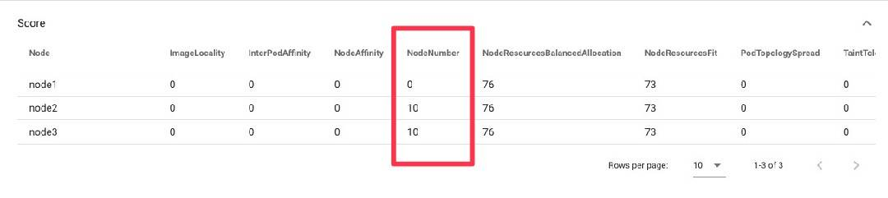

## How to use your custom plugins in the simulator

This doc describes how to use your custom plugins in the scheduler running in the simulator.

### 1. Add your custom plugin's registry in OutOfTreeRegistries function.

Please add your custom plugin's registry in `outOfTreeRegistries` in config package here:

[kube-scheduler-simulator/simulator/scheduler/config/plugin.go](/simulator/scheduler/config/plugin.go)

### 2. Configure the scheduler to enable your custom plugin

You can configure the scheduler to use your custom plugins through KubeSchedulerConfiguration.

[Scheduler Configuration | Kubernetes](https://kubernetes.io/docs/reference/scheduling/config/)

You can change the scheduler configuration in Web UI or
by passing a default KubeSchedulerConfiguration file via the environment variable `KUBE_SCHEDULER_CONFIG_PATH`.

### Example

We will explain the case where you want to add [nodenumber](./sample/nodenumber/plugin.go) plugin as example.

The nodenumber plugin is an example plugin that favors nodes that have the number suffix which is the same as the number suffix of the pod name.
And we can configure it via `NodeNumberArgs`.

First, you need to add registry for the nodenumber plugin to `outOfTreeRegistries`.

```go
outOfTreeRegistries = runtime.Registry{
    // TODO(user): add your plugins registries here.
    nodenumber.Name: nodenumber.New,
}
```

Now you can use the nodenumber plugin in the simulator.

If you apply this configuration to the scheduler, you can see the nodenumber plugin is working (and NodeNumberArgs is applied to the nodenumber plugin) in the simulator,
and see the nodenumber plugin's result like other in-tree plugins.

```yaml
kind: KubeSchedulerConfiguration
apiVersion: kubescheduler.config.k8s.io/v1
# ....
profiles:
  - schedulerName: default-scheduler
    plugins:
      # ....
      multiPoint:
        enabled:
          # ....
          - name: NodeNumber # added
            weight: 10
```

