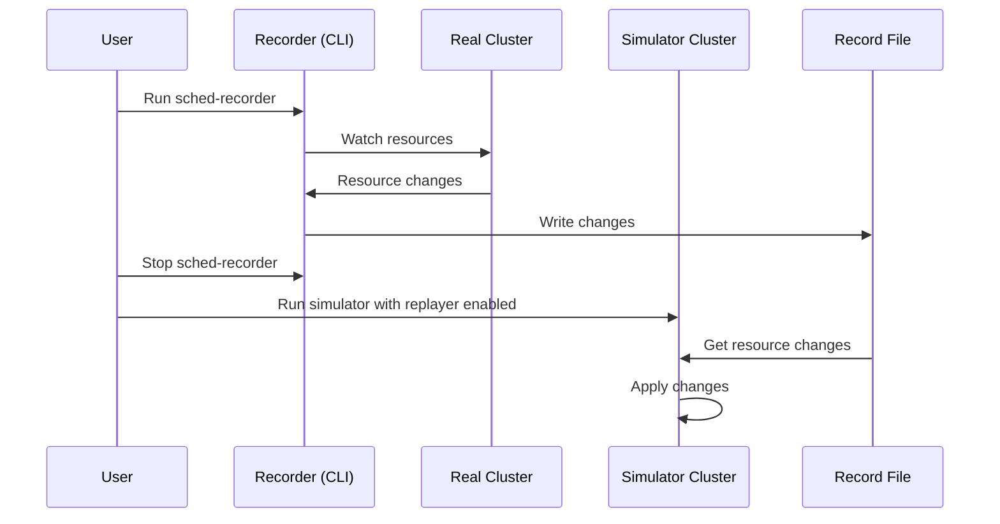

# [Beta] Record your real cluster's changes in resources and replay them in the simulator

You can record resource addition/update/deletion at your real cluster and replay the changes. This feature is useful for reproducing issues that occur in your real cluster.



## Record changes

To record changes from your real cluster, you need to follow these steps:

1. Install the recorder by moving to simulator/ and running `go install ./cmd/sched-recorder` or just `go install sigs.k8s.io/kube-scheduler-simulator/simulator/cmd/sched-recorder`.
2. Start the recorder by `sched-recorder --path /path/to/directory-to-store-recorded-changes`.

> [!NOTE]
> You can add `--timeout` option to set the timeout for the recorder. The value is in seconds. If not set, the recorder will run until it's stopped.  
> You can add `--kubeconfig` option to set the kubeconfig file to use. If not set, the recorder will use the default kubeconfig file.

> [!WARNING]
> When a file already exists at the value of `--path`, it will be overwritten.

### Resources to record

It records the changes of the following resources:

- Pods
- Nodes
- PersistentVolumes
- PersistentVolumeClaims
- StorageClasses

You can tweak which resources to record via the option in [/simulator/cmd/recorder/recorder.go](https://github.com/kubernetes-sigs/kube-scheduler-simulator/blob/master/simulator/cmd/recorder/recorder.go):

```go
recorderOptions := recorder.Options{RecordFile: recordFile,
	// GVRs is a list of GroupVersionResource that will be recorded.
	// If it's nil, DefaultGVRs are used.
	GVRs: []schema.GroupVersionResource{
		{Group: "your-group", Version: "v1", Resource: "your-custom-resources"},
	},
}
```

## Replay changes

To replay the recorded changes in the simulator, you need to follow these steps:

1. Set `true` to `replayEnabled`.
2. Set the path of the file where the changes are recorded to `recordFilePath`.
3. Make sure the file is mounted to the simulator server container.


```yaml:config.yaml
replayEnabled: true
recordFilePath: "/path/to/file-to-store-recorded-changes"
```

```yaml:compose.yml
volumes:
  ...
  - ./path/to/file-to-store-recorded-changes:/path/to/file-to-store-recorded-changes
```

### Resources to replay

It replays the changes of the following resources:

- Pods
- Nodes
- PersistentVolumes
- PersistentVolumeClaims
- StorageClasses

You can tweak which resources to replay via the option in [/simulator/cmd/simulator/simulator.go](https://github.com/kubernetes-sigs/kube-scheduler-simulator/blob/master/simulator/cmd/simulator/simulator.go):

```go
resourceApplierOptions := resourceapplier.Options{
	// GVRsToApply is a list of GroupVersionResource that will be replayed.
	// If GVRsToApply is nil, defaultGVRs are used.
	GVRsToApply: []schema.GroupVersionResource{
		{Group: "your-group", Version: "v1", Resource: "your-custom-resources"},
	},

	// Actually, more options are available...

	// FilterBeforeCreating is a list of additional filtering functions that are applied before creating resources.
	FilterBeforeCreating: map[schema.GroupVersionResource][]resourceapplier.FilteringFunction{},
	// MutateBeforeCreating is a list of additional mutating functions that are applied before creating resources.
	MutateBeforeCreating: map[schema.GroupVersionResource][]resourceapplier.MutatingFunction{},
	// FilterBeforeUpdating is a list of additional filtering functions that are applied before updating resources.
	FilterBeforeUpdating: map[schema.GroupVersionResource][]resourceapplier.FilteringFunction{},
	// MutateBeforeUpdating is a list of additional mutating functions that are applied before updating resources.
	MutateBeforeUpdating: map[schema.GroupVersionResource][]resourceapplier.MutatingFunction{},
}
```
